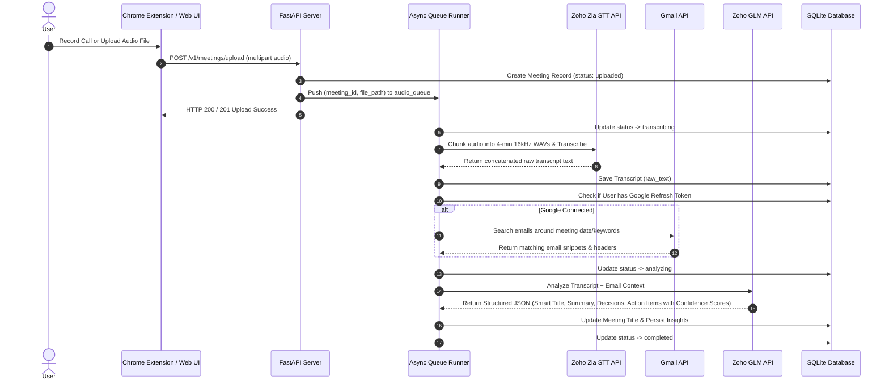
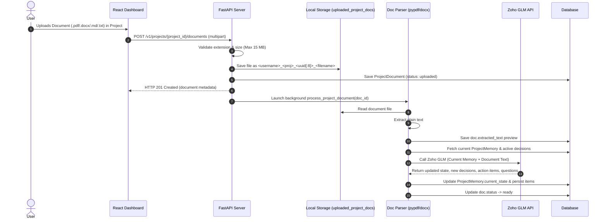
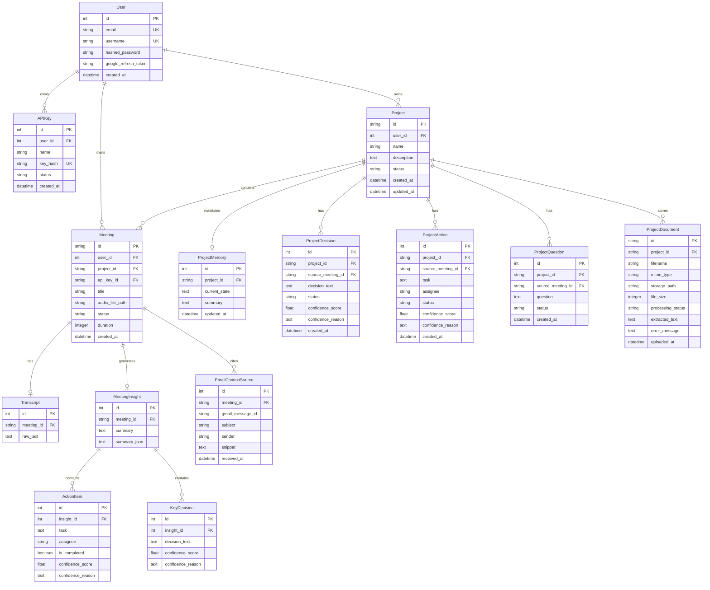

# 🏗️ MeetInMin: System Architecture & Technical Specification

This document provides a comprehensive technical architecture guide for **MeetInMin**, detailing system topography, data pipelines, subsystem implementations, AI confidence scoring, project state memory engines, document parsing, and complete database schemas.

---

## 📐 System Topography

```mermaid
graph TB
    subgraph Client Layer
        EXT["Chrome Extension (MV3)<br/>• tabCapture & Offscreen Audio<br/>• IndexedDB Safety Chunks<br/>• Local WebM Download"]
        SPA["React SPA (Vite)<br/>• Glassmorphic UI<br/>• Dashboard & Project Memory<br/>• Document Upload & List View<br/>• Completed Meeting Filter<br/>• Inline Title Rename<br/>• Confidence Badges & Tooltips"]
    end

    subgraph API Layer (FastAPI)
        AUTH["Auth Router<br/>JWT & Google OAuth 2.0"]
        MTG["Meetings Router<br/>Upload, Rename (PATCH), & Downloads"]
        PROJ["Projects Router<br/>Create, List, Memory Sync, & Document Uploads"]
        EMAIL["Emails Router<br/>Pending Replies, AI Draft & Send"]
        QUEUE["Async Queue Runner<br/>audio_queue & Background Tasks"]
    end


    subgraph Storage Layer
        DB[(SQLite / PostgreSQL<br/>SQLAlchemy 2.0 ORM + Startup Auto-Migrations)]
        DISK_AUDIO["Audio Disk Storage<br/>backend/uploaded_audio/*.webm"]
        DISK_DOCS["Document Disk Storage<br/>backend/uploaded_project_docs/*"]
    end

    subgraph AI & Processing Layer
        STT["Zoho Zia Speech-to-Text<br/>16kHz Mono WAV Chunks"]
        GLM["Zoho GLM (47B/30B IT)<br/>Structured Insights, Confidence Scores,<br/>Smart Titles & Project Memory Synthesis"]
        PARSER["Doc Text Extractor<br/>pypdf & python-docx Parser"]
        GMAIL["Gmail API (OAuth 2.0)<br/>Read-only Mailbox Context"]
    end

    EXT -->|Upload WebM + API Key| MTG
    SPA -->|REST API + Bearer JWT| AUTH & MTG & PROJ
    MTG --> DISK_AUDIO
    PROJ --> DISK_DOCS
    MTG --> QUEUE
    PROJ --> QUEUE
    QUEUE --> STT
    QUEUE --> GMAIL
    QUEUE --> PARSER
    QUEUE --> GLM
    QUEUE --> DB
    AUTH --> DB
```

---

## 🛠️ Technology Stack Breakdown

| Component | Technology | Purpose |
|---|---|---|
| **Backend Framework** | FastAPI (Python 3.11+) | High-performance asynchronous REST API server |
| **Package Manager** | `uv` (Astral) | Lightning-fast Python dependency management |
| **Database & ORM** | SQLAlchemy 2.0 + SQLite / PostgreSQL | Async-compatible ORM with startup schema auto-migrations |
| **Audio Processing** | `pydub` + `ffmpeg` | Audio conversion to 16kHz mono WAV & 4-min chunk splitting |
| **Document Processing** | `pypdf` + `python-docx` | Text extraction from PDF, DOCX, MD, and TXT files |
| **STT Engine** | Zoho Zia Speech-to-Text (`/quickml/.../transcribe`) | High-accuracy Speech-to-Text API |
| **LLM Engine** | Zoho GLM (`crm-di-glm47b_30b_it`) | Meeting insights, itemized confidence scoring, and project state memory synthesis |
| **Mailbox Intelligence**| Gmail REST API (OAuth 2.0 `gmail.readonly`) | Pre-meeting context enrichment from user emails |
| **Frontend Framework**| React 18 + Vite | Modern single-page web dashboard with glassmorphism UI |
| **Browser Extension** | Chrome Extension Manifest V3 | Silent tab audio recording using Offscreen Documents |

---

## 🔄 End-to-End Processing Pipelines

### 1. Audio Processing & Meeting Analysis Pipeline



---

### 2. Project Document Upload & AI Memory Pipeline



---

## 🔬 Subsystem Architecture Deep Dives

### 1. Chrome Extension (`MeetInMinExe`) Architecture
* **Manifest V3 Service Worker** (`background.js`): Manages recording state, session persistence, alarms, and handles file upload to the backend.
* **Offscreen Document API** (`offscreen.js`): Bypasses Chrome Service Worker audio limitations by maintaining an offscreen HTML document that captures tab audio via `chrome.tabCapture.getMediaStreamId()`.
* **IndexedDB Timeslice Safety**: Audio chunks are recorded in 2-second timeslices and saved continuously into IndexedDB (`CHUNKS_STORE`). If the browser closes unexpectedly, un-saved audio chunks are recovered.
* **Authentication**: Requests to `/v1/meetings/upload/{api_key}` are authenticated using SHA-256 hashed API keys stored securely in the database.

---

### 2. Audio Chunker & Zoho Zia STT Service (`app/services/zoho/stt.py`)
Zoho Zia STT imposes strict file size and duration thresholds (`FILE_SIZE_MORE_THAN_ALLOWED_SIZE`). MeetInMin solves this through an automated audio splitting pipeline:
1. **Audio Inspection**: `pydub.AudioSegment` calculates total audio duration.
2. **Dynamic Splitting**: Audio exceeding 4 minutes (240,000 ms) is split into 4-minute segment slices.
3. **Format Standardizing**: Each chunk is exported as a 16kHz mono WAV file (`PCM 16-bit`).
4. **Sequential Processing**: Chunks are transcribed sequentially against Zoho Zia STT with exponential backoff retries.
5. **Concatenation**: Partial chunk transcripts are concatenated with proper space formatting to produce a seamless raw transcript.

---

### 3. Project Document Text Extractor (`app/services/project/doc_parser.py`)
Parses uploaded project files into plain text:
- **`.txt` & `.md`**: Direct UTF-8 / Latin-1 text decode.
- **`.pdf`**: Extracted via `pypdf.PdfReader` iterating across pages. If a PDF is encrypted or image-only without text layers, it returns a clear `DocumentParsingError`.
- **`.docx`**: Extracted via `python-docx.Document` reading paragraph text.
- **Size Boundary**: Files exceeding 15 MB or unreadable formats are rejected before saving.

---

### 4. Project State Memory Engine (`app/services/project/memory_engine.py` & `doc_memory_engine.py`)
Project state memory evolves incrementally without re-processing past meeting transcripts:
1. **Context Building**: `build_project_context(project_id, db)` compiles current `ProjectMemory.current_state`, active decisions, action items, and open questions.
2. **Zoho GLM Synthesis**: The current context + new input (either a completed meeting transcript or an uploaded document text) is sent to Zoho GLM.
3. **Incremental Update**: The engine updates `ProjectMemory.current_state` with a synthesized 2-4 paragraph status and appends newly extracted decisions, action items, and unresolved questions.

---

### 5. Meeting Assignment & Completed Status Enforcement (`PATCH /v1/meetings/{id}`)
- Only meetings with `status == 'completed'` can be assigned to projects.
- When assigned, `process_meeting_added_to_project` background task automatically executes to merge meeting summary, key decisions, and action items into project memory.
- The standalone completed meetings endpoint (`GET /v1/meetings?project_id=standalone&status=completed`) powers the frontend modal filter.

---

### 6. Mailbox Intelligence & AI Email Replies Subsystem (Phase 1)
- **Inbox Classification**: `GET /v1/emails/pending-replies` retrieves user inbox emails using short-lived Google access tokens and passes email bodies + thread histories to Zoho GLM (`crm-di-glm47b_30b_it`). Categorizes messages into `NEEDS_REPLY`, `NO_REPLY_NEEDED`, or `UNCLEAR` with AI reasoning explanations.
- **AI Draft Generation**: `POST /v1/emails/{message_id}/draft-reply` constructs non-hallucinatory contextual drafts matching email threads and optional user instructions.
- **Review & Send**: `POST /v1/emails/send-reply` sends user-reviewed responses via Gmail API (`users.messages.send`) formatted as RFC 2822 messages with complete thread context headers (`In-Reply-To`, `References`, `threadId`).

---


## 🗄️ Database Schema & ER Diagram


