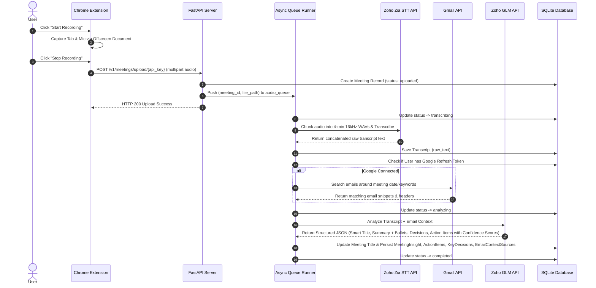
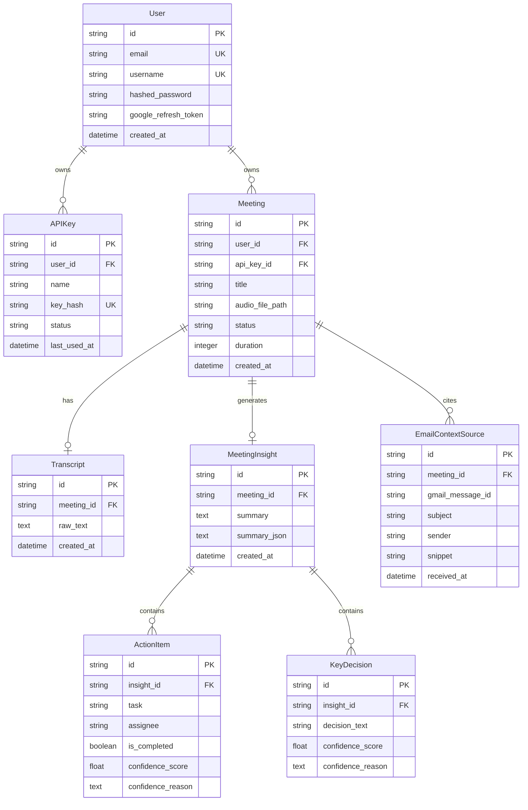

# 🏗️ MeetInMin: System Architecture & Technical Specification

This document provides a comprehensive technical architecture guide for **MeetInMin**, detailing system topography, data pipelines, subsystem implementations, AI confidence scoring, AI prompting strategies, and database schemas.

---

## 📐 System Topography

```mermaid
graph TB
    subgraph Client Layer
        EXT["Chrome Extension (MV3)<br/>• tabCapture & Offscreen Audio<br/>• IndexedDB Safety Chunks<br/>• Local WebM Download"]
        SPA["React SPA (Vite)<br/>• Glassmorphic UI<br/>• Dashboard & Analytics<br/>• Inline Meeting Title Rename<br/>• Confidence Badges & Tooltips<br/>• Transcript & Audio Download"]
    end

    subgraph API Layer (FastAPI)
        AUTH["Auth Router<br/>JWT & Google OAuth 2.0"]
        MTG["Meetings Router<br/>Upload, Rename (PATCH), & Downloads"]
        QUEUE["Async Queue Runner<br/>audio_queue & Worker"]
    end

    subgraph Storage Layer
        DB[(SQLite / PostgreSQL<br/>SQLAlchemy 2.0 ORM + Startup Auto-Migrations)]
        DISK["Local Disk Storage<br/>/uploaded_audio/*.webm"]
    end

    subgraph AI & Context Services
        STT["Zoho Zia Speech-to-Text<br/>16kHz Mono WAV Chunks"]
        GLM["Zoho GLM (47B/30B IT)<br/>Structured Insights Extraction<br/>+ Confidence Scores (0-1) & Smart Titles"]
        GMAIL["Gmail API (OAuth 2.0)<br/>Read-only Mailbox Context"]
    end

    EXT -->|Upload WebM + API Key| MTG
    SPA -->|REST API + Bearer JWT| AUTH & MTG
    MTG --> DISK
    MTG --> QUEUE
    QUEUE --> STT
    QUEUE --> GMAIL
    QUEUE --> GLM
    QUEUE --> DB
    AUTH --> DB
```

---

## 🛠️ Technology Stack Breakdown

| Component | Technology | Purpose |
|---|---|---|
| **Backend Framework** | FastAPI (Python 3.11+) | High-performance asynchronous REST API server |
| **Package Manager** | `uv` (Astral) | Lightning-fast Python dependency management |
| **Database & ORM** | SQLAlchemy 2.0 + SQLite / PostgreSQL | Async-compatible ORM with startup schema auto-migrations |
| **Audio Processing** | `pydub` + `ffmpeg` | Audio conversion to 16kHz mono WAV & 4-min chunk splitting |
| **STT Engine** | Zoho Zia Speech-to-Text (`/quickml/.../transcribe`) | High-accuracy Speech-to-Text API |
| **LLM Engine** | Zoho GLM (`crm-di-glm47b_30b_it`) | Executive summary, key decision & action item extraction with confidence ratings |
| **Mailbox Intelligence**| Gmail REST API (OAuth 2.0 `gmail.readonly`) | Context enrichment from user emails |
| **Frontend Framework**| React 18 + Vite | Modern single-page web dashboard with inline title editing |
| **Browser Extension** | Chrome Extension Manifest V3 | Silent tab audio recording using Offscreen Documents |

---

## 🔄 End-to-End Audio & AI Processing Pipeline



---

## 🔬 Subsystem Architecture Deep Dives

### 1. Chrome Extension (`MeetInMinExe`) Architecture
* **Manifest V3 Service Worker** (`background.js`): Manages recording state, session persistence, alarms, and handles file upload to the backend.
* **Offscreen Document API** (`offscreen.js`): Bypasses Chrome Service Worker audio limitations by maintaining an offscreen HTML document that captures tab audio via `chrome.tabCapture.getMediaStreamId()`.
* **IndexedDB Timeslice Safety**: Audio chunks are recorded in 2-second timeslices and saved continuously into IndexedDB (`CHUNKS_STORE`). If the browser closes unexpectedly, the offscreen script automatically recovers un-saved audio chunks (`MeetInMin_recovered.webm`).
* **Authentication**: Requests to `/v1/meetings/upload/{api_key}` are authenticated using SHA-256 hashed API keys stored securely in the database.

---

### 2. Audio Chunker & Zoho Zia STT Service (`app/services/zoho/stt.py`)
Zoho Zia STT imposes strict file size and duration thresholds (`FILE_SIZE_MORE_THAN_ALLOWED_SIZE`). MeetInMin solves this through an automated audio splitting pipeline:

1. **Audio Inspection**: `pydub.AudioSegment` calculates total audio duration.
2. **Dynamic Splitting**: Audio exceeding 4 minutes (240,000 ms) is split into 4-minute segment slices.
3. **Format Standardizing**: Each chunk is exported as a 16kHz mono WAV file (`PCM 16-bit`).
4. **Sequential Processing**: Chunks are transcribed sequentially against Zoho Zia STT with exponential backoff retries.
5. **Concatenation**: Partial chunk transcripts are concatenated with proper space formatting to produce a seamless raw transcript.

---

### 3. Gmail Context Builder (`app/services/gmail/context_builder.py`)
When a user has connected their Google Workspace account:

1. **Keyword Extraction**: A fast Zoho GLM call extracts domain keywords, project names, and participant references from the raw transcript.
2. **Context Window Querying**: MeetInMin queries the Gmail API for messages received within **7 days before or after** the meeting date.
3. **Attribution Tracking**: Matching email metadata (subject, sender, timestamp, snippet) is included in the GLM context.
4. **Privacy-First Data Policy**: Raw email bodies are **never stored** in the database. Only metadata records (`EmailContextSource`) are saved for UI attribution display.

---

### 4. Zoho GLM Intelligence & Confidence Engine (`app/services/zoho/glm.py`)
MeetInMin uses Zoho GLM (`crm-di-glm47b_30b_it`) to transform unstructured transcripts into executive meeting intelligence with itemized confidence scoring.

#### System Prompt & Output Schema Rules:
* **Smart Meeting Titles**: Extracts a 3 to 6 word descriptive title (`meeting_title`) summarizing the core discussion.
* **Confidence Scoring**: Computes a numeric float score (`0.00` to `1.00`) and a `confidence_reason` for every summary bullet, key decision, and action item:
  - **High Confidence (0.85 – 1.00)**: Directly and explicitly spoken in transcript.
  - **Medium Confidence (0.60 – 0.84)**: Contextually inferred or supported by email context.
  - **Low Confidence (0.00 – 0.59)**: Assumed or speculative due to missing transcript context.
* **Transcript Primacy**: The transcript is strictly the primary source of truth; email context is supplementary only.
* **Exhaustive Extraction**: Captures *every single task*, commitment, and decision mentioned.

---

### 5. Manual Meeting Creation & Web Audio Upload Architecture (`app/api/v1/meetings.py`)
MeetInMin supports dual audio ingestion streams: (1) silent tab recording via the Chrome extension, and (2) direct dashboard meeting creation with manual web audio uploads.

* **Draft Meeting Creation (`POST /v1/meetings`)**: Creates a placeholder meeting record with a validated title (2–255 characters), setting `status="created"`, `audio_file_path=None`, and `api_key_id=None`.
* **Web Dashboard Upload (`POST /v1/meetings/{meeting_id}/upload`)**: Accepts user-uploaded audio files (`.webm`, `.mp3`, `.wav`, `.m4a`, `.mp4`, `.flac`), saves them asynchronously to disk, updates status to `"uploaded"`, and pushes the meeting into `audio_queue`.
* **Automatic `ffmpeg` Standardization**: Audio files uploaded via the frontend are automatically processed through the `split_audio_into_wav_chunks` pipeline, converting them to 16kHz mono WAV chunks before routing to Zoho STT and Zoho GLM.
* **Inline Renaming (`PATCH /v1/meetings/{meeting_id}`)**: Allows users to rename meeting titles anytime with strict length validation (min 2, max 255 chars).

---

### 6. Startup Auto-Migrations & Queue Recovery (`app/db/database.py`)
* **Schema Auto-Migrations** (`run_auto_migrations`): On server startup, non-destructive `ALTER TABLE` statements automatically ensure database columns (`summary_json`, `confidence_score`, `confidence_reason`) exist, preventing breaking schema updates on existing deployments.
* **Sequential Queue Execution** (`queue_manager.py`): An `asyncio.Queue` processes uploaded audio sequentially to prevent Zoho API rate-limiting.
* **Crash & Restart Recovery** (`app/main.py`): On server startup, MeetInMin scans the database for meetings stuck in `uploaded`, `transcribing`, or `analyzing` status and automatically re-queues them for background completion.

---

### 6. Provider-Agnostic AI Service Layer
Although MeetInMin ships configured for **Zoho Zia STT** and **Zoho GLM**, the AI pipeline layer (`app/services/zoho/glm.py` and `app/services/zoho/stt.py`) is fully decoupled:
* **Custom LLM Providers**: Replace headers and POST payload structures in `analyze_transcript_with_zoho_glm()` to target Google Gemini (`https://generativelanguage.googleapis.com/...`), OpenAI GPT-4o, Anthropic Claude, or local Ollama endpoints while retaining Pydantic validation.
* **Custom STT Providers**: Replace `_transcribe_single_wav_file()` in `stt.py` to route WAV audio chunks to OpenAI Whisper, Deepgram, or AssemblyAI.

---

## 🗄️ Database Schema & ER Diagram


